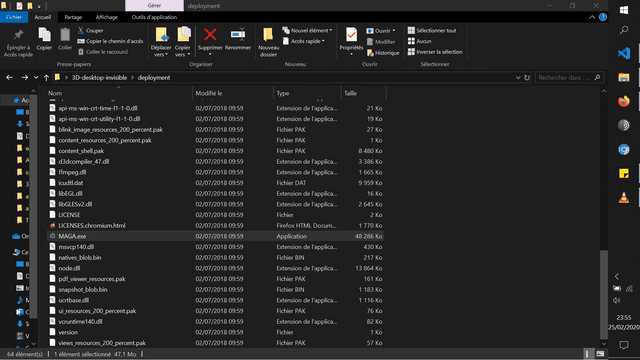
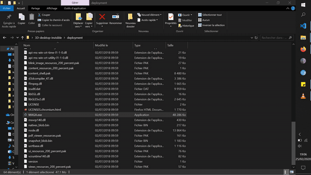
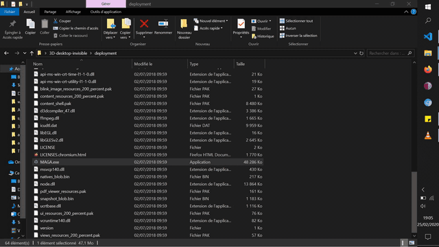

# <b>MAGA</b>

• <b>MAGA</b> is the most explosive app crash message available on github.

• <b>MAGA</b> let you personalize your error box message.

• <b>MAGA</b> is available with 4 random explosion animation patterns.

## <b>💥 Explosions</b>

<p float="left">
  
  
  
  
</p>

## <b>💻 Usage</b>

Download deployment folder and just run programmatically MAGA.exe from your software.

MAGA is functional on linux and macOS but you have to make the deployment from source by yourself <a href="https://github.com/electron-userland/electron-builder">https://github.com/electron-userland/electron-builder</a>

## <b>⚙️ Configuration</b>

You can change explosion animation and message box text by editing config.json file.

Located at root in git folder or under deployment\resources\app for deployed version.

```javascript
config='[{"id" : "1", "title" : "Application crash detected", "description" : "This application has crashed and will now close."}]';
```

id range is 1-4

## <b>📦 Installation for development mode only</b> 

At root of cloned folder open terminal and type : `npm install`

Then run : `electron .`


## <b>📄 License</b>

This project is licensed under the MIT License - see the [LICENSE.md](LICENSE.md) file for details
